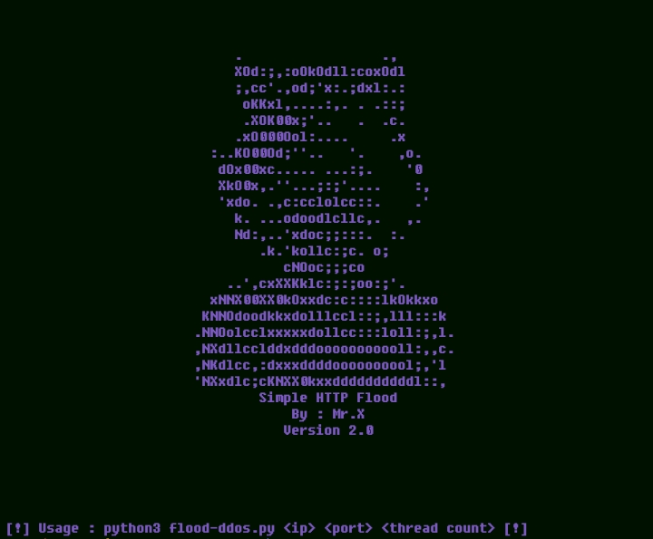

# flood-ddos


## introduction
HTTP Flood is a type of DDOS {Distributed Denial of Service} attack where an attacker manipulates unsolicited HTTP and POST requests to attack a web server or application

## Instalations
```
$ pkg update && pkg upgrade
$ pkg install python
$ pkg install python3
$ pkg install git
$ git clone https://github.com/Whomrx666/flood-ddos.git
$ cd flood-ddos
$ python flood-ddos.py
```
## Usage
```
python3 flood-ddos.py <ip> <port> <thread count>
```
## Update
Version 2.0
•Ddos with proxies

## Instructions
- **IP target**: Target IP address
- **Port**: The port you want to use, for example, is 80
- **Thread count**: How many floods do you want to send to the target server

## Note
Only applies to websites that use an http address

## Observation
This is a tool for education only, I am not responsible for any misuse
### Original Author
<a href="https://github.com/Whomrx666"></a>

### <<< If you copy , Then Give me The Credits >>>

## CONNECT WITH ME :

[](https://whomrxhackers.blogspot.com/)
[](https://twitter.com/whomrx666)
[](https://youtube.com/@whomrx666)
[](https://facebook.com/https://www.facebook.com/whomrx.666)
[](https://t.me/@Whomr_X)
[](https://wa.me/6285933663749)
[](https://www.tiktok.com/@whomr.x)

**If you want to donate, click on the button**
<a href="https://saweria.co/whomrx"></a>

### Visitors :


<b>Happy ddos friend : ]<b>
